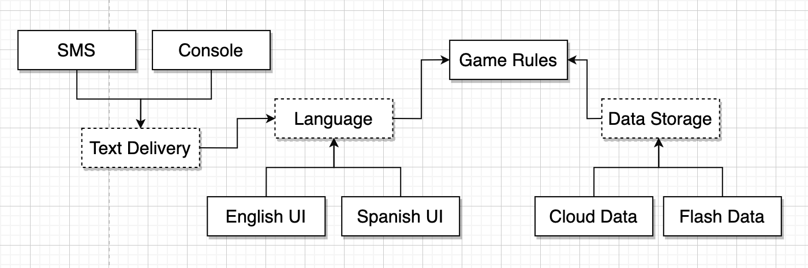
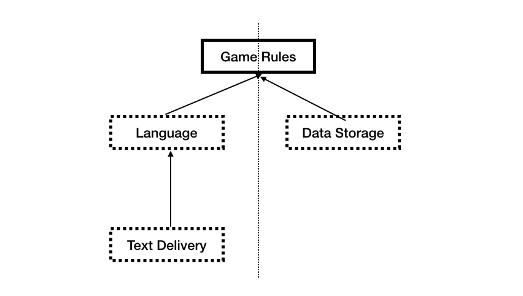

## 25. 계층과 경계

대다수 시스템은 많은 컴포넌트 수로 이루어짐
### 예시 : 옴퍼스 사냥 게임
텍스트 기반의 명령어(GO EAST,SHOOT WEST)를 받아 동굴을 탐험

1. 게임의 언어를 다양화 한다면?  
   => 언어 독립적인 규칙 컴포넌트와 UI 컴포넌트로 분리하자
2. 게임 데이터를 영구적인 스토리지에 저장해야한다면?  
   => 데이터 컴포넌트를 추가하자  

### 클린 아키텍쳐?
실제 시스템은 더 많은 변경의 축이 있고 이로 인한 잠재적 경계가 있을 수 있음.  
텍스트를 주고받는 메커니즘을 다양화해야 한다면 아래와 같이 변함

GameRules를 보면 Language가 구현하는 인터페이스와, Language에 제공하는 인터페이스가 속함.  
이러한 Boundary 인터페이스가 정의하는 API는 의존성 흐름 상위에 위치한 컴포넌트에 속함.   

순수 API 컴포넌트만 보면, 모든 의존성이 상위로 향하도록 구성되어 있음. GameRules는 최상위 수준 정책을 가지는 컴포넌트로, 의존성 방향도 이에 맞게 배치됨.  
이러한 구성으로 정보의 흐름을 사용자와 통신, 데이터의 영속성으로 나누고, 두 흐름은 최상단 GameRules에서 만나 최종 처리됨  

### 흐름 횡단하기    
데이터의 흐름은 시스템이 복잡해질수록 더 많은 흐름으로 나뉨(그림 25.5)

### 흐름 분리하기
모든 흐름이 최상단의 단일 컴포넌트에서 만나는가?  
위 예제에서 GameRules를 Player Management와 Move Management로 분리하고 MSA로 구현한다면, Move와 Player 사이에도 아키텍쳐의 경계가 생성됨(그림 25.7)

### 결론
아키텍쳐 경계는 어디에나 존재한다. 
추상화가 필요하리라고 미리 예측해서는 안됨. 오버 엔지니어링이 나쁠때가 더 많다.  
그렇지만 미래를 내다보고 현명하게 추측해야함. 경계를 필요로 하는 부분에 주목하고, 경계를 무시할때의 비용과 경계를 구현하는 비용을 잘 비교해라

## 26. 메인 컴포넌트
메인 컴포넌트=>나머지 컴포넌트를 생성, 조정, 관리하는 하나의 컴포넌트 

메인은 궁극적으로 가장 낮은 수준의 정책  
시스템의 진입점으로 OS이외의 어떤 것도 메인에 의존하지 않음  
메인은 Factory, Strategy, 시스템 전반을 담당하는 기반 설비 생성후, 더 높은 수준을 담당하는 부분으로 제어권을 넘기는 역할  
=> 지저분한 컴포넌트 중에서도 가장 지저분한 컴포넌트. 아키텍쳐에서 가장 바깥 원에 위치하는 컴포넌트

예제 p.248
main에서 Factory를 통해 게임을 만들고, 맵을 생성하고, 명령어를 받아 해석한다.
그러나 처리는 상위 컴포넌트로 넘김.

### 결론
메인은 어플리케이션의 플러그인이라고 생각하자. 서로 다른 설정별로 메인을 여러개 두면 환경설정 문제를 쉽게 해결할 수도 있다.

## 27. 크고 작은 모든 서비스들
서비스를 사용하면 결합이 분리되나? 서비스를 사용하면 개발과 배포 독립성을 지원하는가?
### 서비스 아키텍쳐?
https://www.samsungsds.com/kr/insights/msa.html  
시스템 아키텍쳐는 의존성 규칙을 준수하며 고수준 정책을 저수준의 세부사항을 분리하는 경계에 의해 정의

의존성 규칙을 따르며 경계를 넘나드는 서비스들이 아키텍쳐 적으로 중요한 서비스.

### 서비스의 이점?
#### 결합 분리의 오류
서비스 사이의 결합이 확실히 분리된다.  
=> 공유 자원에 의해 결합 가능성이 여전히 존재한다.(eg> 같은 데이터 레코드를 사용하는 서비스들은 이에 간접적으로 결합되게 됨)  
=> 잘 정의된 인터페이스는 함수의 경우에도 다를게 없기에 서비스만의 이점은 아님
#### 개발 및 배포 독립성의 오류
전담팀이 서비스를 소유하고 운영하므로 각 서비스를 독립적으로 유지보수 운영할 수 있다.  
=> 대규모 엔터프라이즈 시스템은 꼭 서비스 기반이 아닌 아키텍쳐로도 구축되고 있음  
=> 데이터나 행위의 결합 정도에 따라 서비스 간 개발, 배포, 운영을 조정할 필요가 있음

### 예 : 야옹이 문제
MSA로 구성된 택시 통합 시스템. (p.256)
신규 기능 고양이를 배달하는 서비스를 제공하려면 어디가 바뀌어야 하나?  => 모든 곳이 바뀌어야함.

### 객체가 구출하다.
컴포넌트 기반 아키텍쳐에선 다형적 확장이 가능한 클래스를 사용하여 문제 해결(p.257)
UI를 제외하곤 변경할 필요가 없어짐

### 컴포넌트 기반 서비스
서비스에서도 SOLID설계하고 컴포넌트 구조를 갖출 수 있다. 이를 통해 기존 코드 변경 없이 새로운 컴포넌트 추가가 가능(p.258)

### 횡단 관심사
>횡단 관심사 : 여러 모듈에 거쳐서 영향을 미치는 관심사

아키텍쳐 경계는 서비스 사이에 있지 않음. 오히려 서비스를 관통한다.  
서비스 내부는 의존성 규칙도 준수하는 컴포넌트 아키텍쳐로 설계해야함.  
아키텍쳐 경계를 정의하는 것은 서비스 내의 위치한 컴포넌트

### 결론
시스템 아키텍쳐는 내부에 그어진 경계와 경계를 넘나드는 의존성에 의해 정의되며, 서비스 기반 아키텍쳐에서도 서비스를 구성하는 내부 컴포넌트에 의해 정해진다.

## 28. 테스트 경계

테스트는 시스템의 일부이며 아키텍쳐에도 관여한다.

테스트는 아키텍쳐의 가장 바깥쪽의 원에 위치한다. 어떠한 것도 테스트에 의존하지 않으며, 테스트는 시스템을 향해 의존한다.

테스트는 독립적으로 배포 가능하고, 가장 고립되어 있다.

### 테스트를 고려한 설계
테스트를 설계와 잘 통합하지 않으면, 테스트가 깨지기 쉽고 시스템이 뻣뻣해진다.

깨지기 쉬운 테스트는 시스템을 뻣뻣하게 만듬 
=> 뭐하나 바꿨더니 테스트 대량 실패 => 그럼 안함

테스트 설계도 소프트웨어 설계 원칙과 동일 = 변동성이 있는 것에 의존하면 안됨(eg>GUI)

### 테스트 API
테스트에 사용하는 특화 API를 만들어라. 

어플리케이션과 테스트의 구조적 결함은 시스템을 뻣뻣하게 만들고, 테스트를 깨지기 쉽게 만듬.

테스트 API를 통해 어플리케이션과 테스트의 결합을 끊어서 유연성을 높일 수 있음 

### 결론
테스트도 시스템의 일부다. 테스트도 시스템의 일부로 보고 잘 설계되어야 버려지지 않고, 원래의 목적을 달성할 수 있다.

